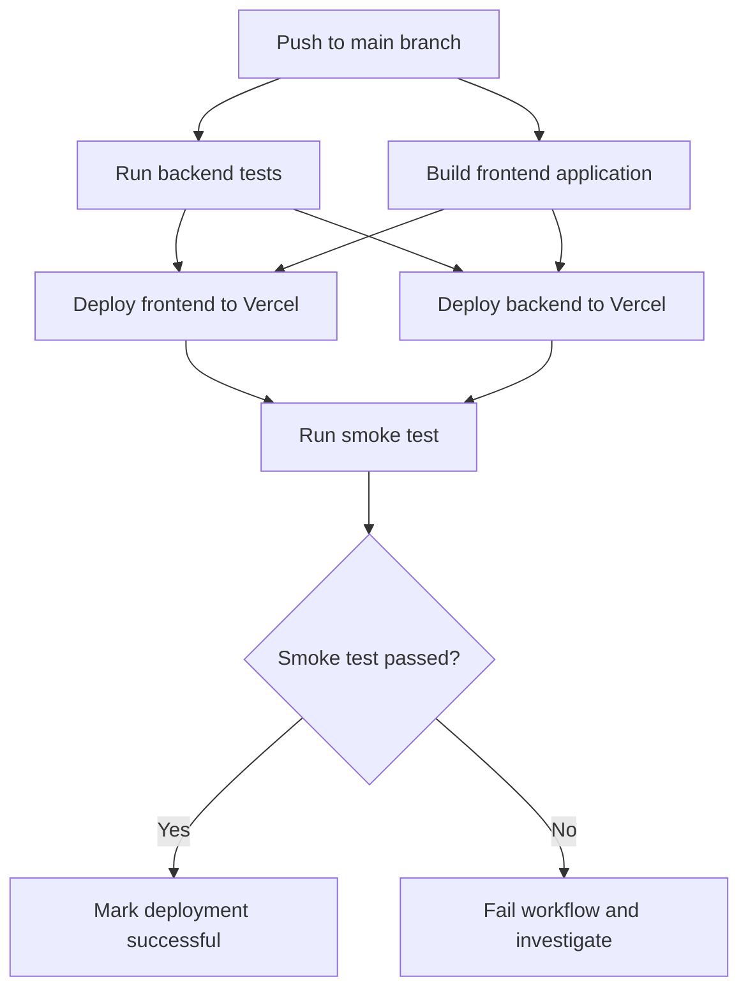

# CI/CD Pipeline Diagram

```mermaid
flowchart TD
    A[Push to main branch] --> B[Run backend tests]
    A --> C[Build frontend application]
    B --> D[Deploy frontend to Vercel]
    C --> D
    B --> E[Deploy backend to Vercel]
    C --> E
    D --> F[Run smoke test]
    E --> F
    F --> G{Smoke test passed?}
    G -- Yes --> H[Mark deployment successful]
    G -- No --> I[Fail workflow and investigate]
```

The diagram matches the CI/CD workflow described in the project report and shows the test, build, deploy, and smoke-test stages in order.